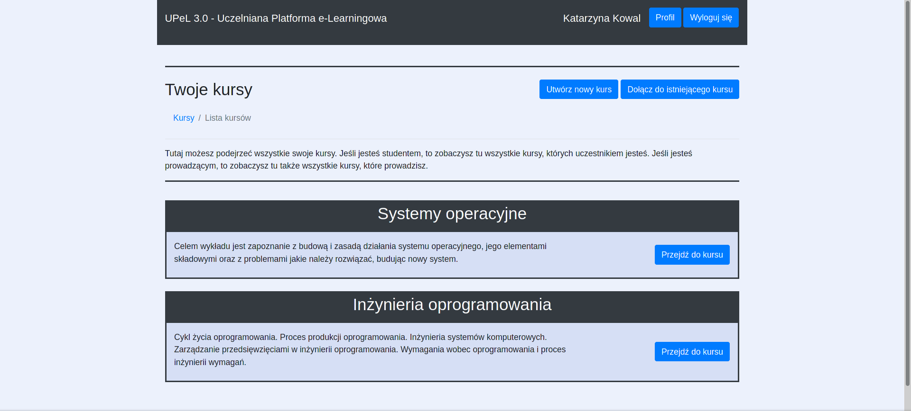
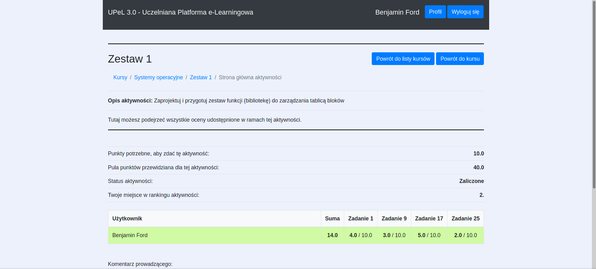
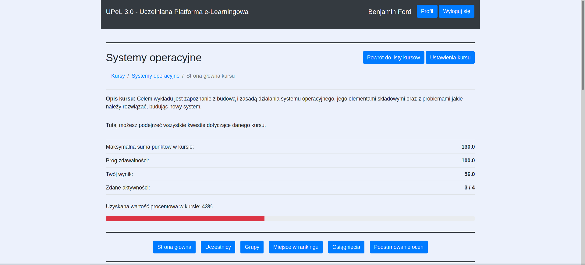
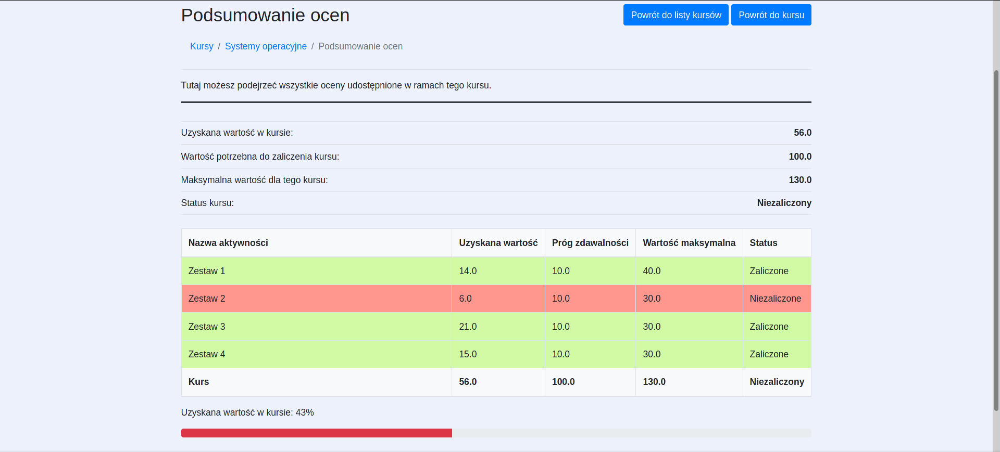

# upel3.0
This is a university group project done during lab classes on software engineering.

## About
UPeL3.0 is a moodle-like web application created for lecturers and students to share students’ marks 
on different activities in different courses. The app allows students to track their progress during 
a course and to see how many points are needed to pass a subject as well as how many points maximum 
they can get. Lecturers can provide descriptions to different activities and sub-activities, so that 
students can see what exact part of activity they are marked for. There are also some statistics available for users.
  
The app is in Polish.

## Used technologies
- Java
- Spring Boot
- H2 database
- Gradle
- Thymeleaf
- Bootstrap & JavaScript

## Launch
To run the app locally run the following command from the project root folder:  
`./gradlew bootRun`
  
You can also access the deployed app at [https://upel3.herokuapp.com](https://upel3.herokuapp.com).

## Features
- Creating new user accounts by admin
- Creating new courses by a lecturer
- Creating new activities and sub-activities as well as their descriptions in a course by a lecturer
- Generating unique course codes
- Grading students as well as adding comments to their grades by a lecturer
- Changing an aggregation function for the course final grade based on activities grades by lecturer
- Creating a group of students and adding group marks by a lecturer
- Signing up for a course using a unique course code by a student
- Viewing all gained marks as well as visualisation whether activity/course is passed or not by a student
- Hiding courses
- Obtaining special achievements for great progress by a student
- Viewing an activity ranking place by a student

## Screenshots
There are screenshots of some app screens.

## Contributors
- [Anna Nosek](https://github.com/Enkelian)
- [Marcin Zięba](https://github.com/marcinz99)
- [Ksenia Fiodarava](https://github.com/xenoteo)
- [Jakub Wybra](https://github.com/wyder110)
- [Karol Stach](https://github.com/Krlstch)
- [Wojciech Makaruk](https://github.com/Ivanowicz)